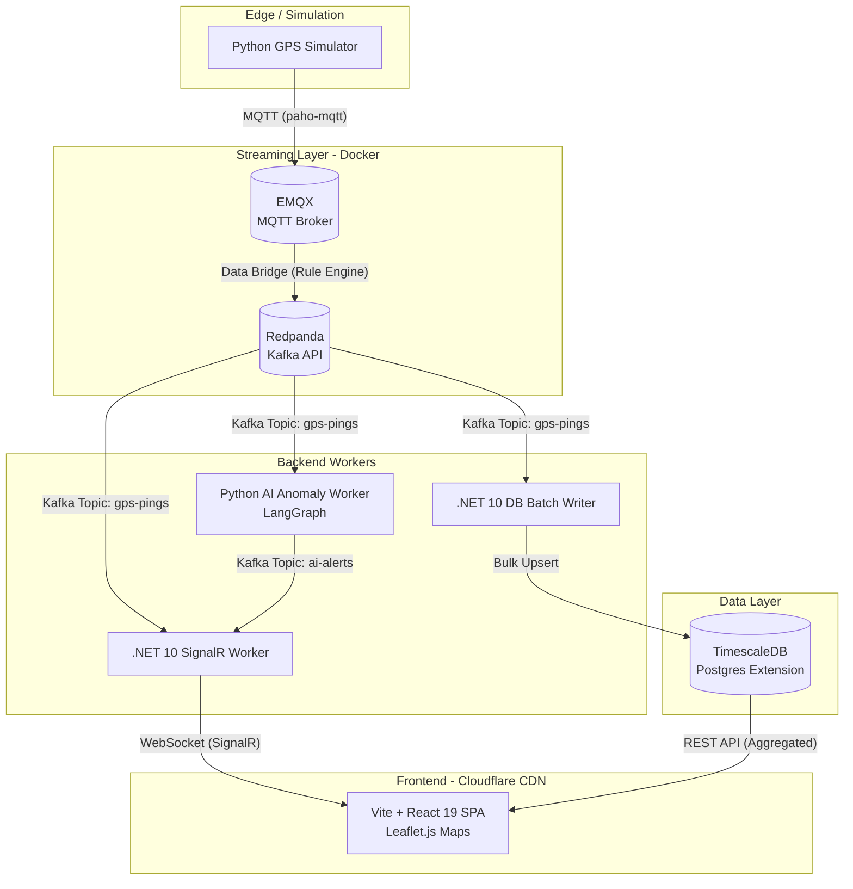

# FleetPulse System

## Document Revision

| Version | Date | Author | Description
| :--- | :--- | :--- | :--- |
| 1.0 | 2026-07-08 | jose valdes | Created: Architectural document created |
| 1.1 | 2026-07-09 | jose valdes | Added: native MQTT proxy was deprecated inside redpanda. EMQX Broker container is added to receive MQTT messages and forward them to RedPanda |


# Architecture
## Overview
FleetPulse is a real-time, AI-powered logistics control tower designed to monitor a simulated fleet of delivery motorcycles. It demonstrates a high-throughput, event-driven architecture capable of ingesting high-frequency GPS telemetry, analyzing it for anomalies via LLMs, and visualizing it dynamically on a live map.

This project highlights modern distributed systems concepts: Stream Processing, Micro-batching, Temporal Data Compression, and Decoupled Backend Workers.

## High-Level Architecture
The system follows a strict fan-out pattern. Edge devices (simulated) publish telemetry to a stream broker. Independent backend services consume the stream concurrently based on their domain responsibility. The frontend operates as a pure SPA, receiving real-time pushes via WebSockets.



## Technology Stack & Rationale
| Layer | Technology | Architectural Rationale |
| :--- | :--- | :--- |
| **Telemetry Ingestion** | Python + `paho-mqtt` | MQTT is the industry standard for IoT/edge devices due to minimal bandwidth and battery overhead. |
| **MQTT Broker** | EMQX Broker (Docker) | MQTT broker for IoT that nativily integrates to Kafka-compatible RedPanda. |
| **Message Broker** | Redpanda (Docker) | Native Kafka API compatibility.  |
| **Real-Time Push** | .NET 10 Worker + SignalR | Maintains persistent WebSocket state. SignalR Groups natively handle routing updates to specific fleet managers. |
| **AI / Analytics** | Python + `aiokafka` + LangGraph | Decoupled async worker. Consumes streams without blocking, uses LLMs for contextual anomaly explanations. |
| **Data Storage** | PostgreSQL + TimescaleDB | Relational reliability for transactions, combined with TimescaleDB's `Hypertables` for high-performance time-series compression and `time_bucket()` aggregations. |
| **Frontend** | Vite + React 19 + TS | Pure SPA. Server-Side Rendering (Next.js) is intentionally avoided as real-time data is stale the moment it's rendered. Vite provides superior HMR for map UI tuning. |
| **Deployment (FE)** | Cloudflare Pages | Static assets served at the edge. Zero cold starts, zero cost, inherently secure. |
| **Deployment (BE)** | Docker Compose (Local) <br> AWS ECS / Azure Container Apps (Prod) | Containerized workloads allow independent scaling of the AI worker vs. the DB writer based on load. |
| **DB Batch Writer** | .NET DB Batch Writer (background service) | Fast developement with Dapper + inline SQL. Using Npgsql library  |
|
## Architectural Deep Dives

1. The Database Ingestion Pipeline (DB Batch Writer)
Writing 250 individual GPS pings per second directly to a relational database causes severe I/O bottlenecks and lock contention. The DB Writer solves this using a 3-stage pipeline:

Micro-Batching: The worker consumes the Kafka stream but holds GPS pings in an in-memory buffer, flushing to the database in bulk every 5 seconds (or at 1,000 records). This turns 250 I/O ops/sec into ~25 bulk ops/sec.
Temporal Compression: Before flushing, the logic drops redundant data. If a driver is stopped at a red light for 30 seconds, only the first and last ping are kept. Moving highway pings are down-sampled to 1 point per 15 seconds.
Dual-Table Write Strategy:
gps_history (Hypertable): Receives the bulk-inserted, compressed historical data. TimescaleDB automatically compresses data older than 7 days to save ~90% disk space.
driver_latest_state (Standard Table): Receives a continuous UPSERT. This table strictly contains exactly one row per active driver (e.g., 500 rows), allowing the frontend to query current locations in milliseconds without scanning millions of historical rows.
2. Frontend Architecture: Why a Pure SPA?
A common question is why this project uses Vite + React instead of Next.js (which was used in the companion e-commerce project).

Stale Data Problem: Next.js Server Components render HTML on the server. By the time the HTML reaches the browser, the GPS coordinates have already changed. SSR provides zero value for live moving objects.
Connection State: WebSockets require long-lived, stateful connections. Next.js Serverless functions (Vercel) aggressively terminate idle connections and enforce strict timeouts.
Performance: Vite's Hot Module Replacement (HMR) is nearly instantaneous, which is critical when iterating on complex map animations and real-time chart state.
3. Decoupled AI Alerting
The AI worker does not push alerts directly to the frontend. Instead, it evaluates the gps-pings stream, and if an anomaly is detected (e.g., a driver is stationary in a high-risk zone), it publishes a new event to a separate Kafka topic: ai-alerts.

The SignalR Worker subscribes to both topics (gps-pings and ai-alerts) and acts as the single gateway to the browser. This ensures the frontend remains completely agnostic to how many backend workers are processing data behind the scenes.
	   

## Database Access 

```
[ Redpanda Topic: "gps-pings" ]
       │
       ▼
[ .NET DB Batch Writer (Background Service) ]
       │
       ├──> 1. In-Memory Buffer (holds for 5 seconds)
       │
       ├──> 2. Compression Logic (drops stopped-driver duplicates)
       │
       ├──> 3. Bulk INSERT -> TimescaleDB `gps_history` table (Hypertable)
       │
       └──> 4. UPSERT -> TimescaleDB `driver_latest_state` table (500 rows)
```


## Local Development Topology
During local development, the entire distributed system is orchestrated via a single docker-compose.yml file, ensuring zero friction for developers cloning the repository.

```
┌─────────────────────────────────────────────────────────┐
│                  Docker Compose Network                 │
│                                                         │
│  ┌─────────────┐  ┌─────────────┐  ┌──────────────────┐ │
│  │  EMQX       │  │ .NET SignalR│  │ Python AI Worker │ │
│  │ (MQTT Broker│  │   Worker    │  │   (LangGraph)    │ │
│  └──────┬──────┘  └─────┬───────┘  └──────────────────┘ │
│         │               │                               │
│         │ Data Bridge   │                               │
│         ▼               │                               │
│  ┌────────────┐         │                               │
│  │  Redpanda  │<>───────┘                               │
│  │ (Kafka API)│                                         │
│  └──────┬─────┘                                         │
│         │                                               │
│  ┌──────┴─────┐  ┌────────────┐                         │
│  │TimescaleDB │<>│ .NET DB    │                         │
│  │  (Postgres)│  │   Writer   │                         │
│  └────────────┘  └────────────┘                         │
└─────────────────────────────────────────────────────────┘
         ▲                              ▲
         │                              │
    [Python Simulator]            [Vite React SPA]
    (Runs on host)                (Runs on host :5173)
```
	
## Repository Structure

```SQL
-- Hypertable for historical GPS data
CREATE TABLE gps_history (
    driver_id      VARCHAR(50) NOT NULL,
    timestamp      TIMESTAMPTZ NOT NULL,
    latitude       DOUBLE PRECISION NOT NULL,
    longitude      DOUBLE PRECISION NOT NULL,
    speed          DOUBLE PRECISION,
    heading        INTEGER,
    accuracy       DOUBLE PRECISION,
    raw_payload    JSONB
);

-- Latest state table (one row per driver)
CREATE TABLE driver_latest_state (
    driver_id      VARCHAR(50) PRIMARY KEY,
    latitude       DOUBLE PRECISION NOT NULL,
    longitude      DOUBLE PRECISION NOT NULL,
    speed          DOUBLE PRECISION,
    heading        INTEGER,
    last_seen      TIMESTAMPTZ NOT NULL,
    status         VARCHAR(20) DEFAULT 'moving'  -- moving, stopped, offline
);
```


## Data Models
** MQTT message model

```JSON
	message = {
		"driver_id": "string"
		"timestamp": "datetime - isoformat",
		"latitude": "float",
		"longitude": "float",
		"speed_kmh": "int",
		"heading_degrees": "float",
		"accuracy_meters": "float",
		"status": "string" "decelerating" else "moving",
		"vehicle_type": "string",
	}
```

```
	message = {
		"driver_id": self.config.driver_id,
		"timestamp": datetime.now(timezone.utc).isoformat(),
		"latitude": round(lat, 6),
		"longitude": round(lng, 6),
		"speed_kmh": round(self.current_speed_kmh, 1),
		"heading_degrees": round(self.heading, 1),
		"accuracy_meters": round(abs(random.gauss(4.0, 1.5)), 1),
		"status": self.status if self.status != "decelerating" else "moving",
		"vehicle_type": self.config.vehicle_type,
	}
	
```

** .net DbBatchWriterWorker Data Model
```c#
 public class GpsPing
 {
     public int Id { get; set; }

     [JsonPropertyName("driver_id")]
     public string DriverId { get; init; } = string.Empty;

     [JsonPropertyName("latitude")]
     public double Latitude { get; init; }

     [JsonPropertyName("longitude")]
     public double Longitude { get; init; }

     [JsonPropertyName("speed_kmh")]
     public double Speed { get; set; }

     [JsonPropertyName("heading_degrees")]
     public double Heading { get; init; }

     [JsonPropertyName("accuracy_meters")]
     public double Accuracy { get; init; }

     [JsonPropertyName("status")]
     public string Status { get; init; } = string.Empty;

     [JsonPropertyName("vehicle_type")]
     public string? VehicleType { get; init; }

     [JsonPropertyName("timestamp")]
     public DateTimeOffset Timestamp { get; init; }

     [JsonIgnore]
     public string? RawPayloadJson { get; set; }

 }
 
 public class DriverLastState
 {
     public string Driver_Id { get; set; } = string.Empty;

     public double Latitude { get; set; }

     public double Longitude { get; set; }

     public double Speed { get; set; }

     public double Heading { get; set; }

     public DateTimeOffset Last_Seen { get; set; }

     public string Status { get; set; } = string.Empty;

 }
 
```

## DbBatchWriterWorker

```
┌─────────────────────────────────────────────────────────────────┐
│                    DbBatchWriterWorker                          │
│                                                                 │
│  ┌─────────────────────┐     ┌──────────────────────────────┐   │
│  │ RedpandaConsumer    │     │  Flush Loop (every 5s)       │   │
│  │ Service             │     │                              │   │
│  │                     │     │  1. GetBatchedPings()        │   │
│  │  Consume() ────────►│     │  2. Compress (TODO)          │   │
│  │       │             │     │  3. BulkInsert (TODO)        │   │
│  │       ▼             │     │  4. UpsertLatest (TODO)      │   │
│  │  ┌──────────────┐   │     │  5. ClearBatch()             │   │
│  │  │  Concurrent  │   │     └──────────────────────────────┘   │
│  │  │  Bag<GpsPing>│   │                                        │
│  │  │  (Buffer)    │   │                                        │
│  │  └──────────────┘   │                                        │
│  └─────────────────────┘                                        │
└─────────────────────────────────────────────────────────────────┘
```