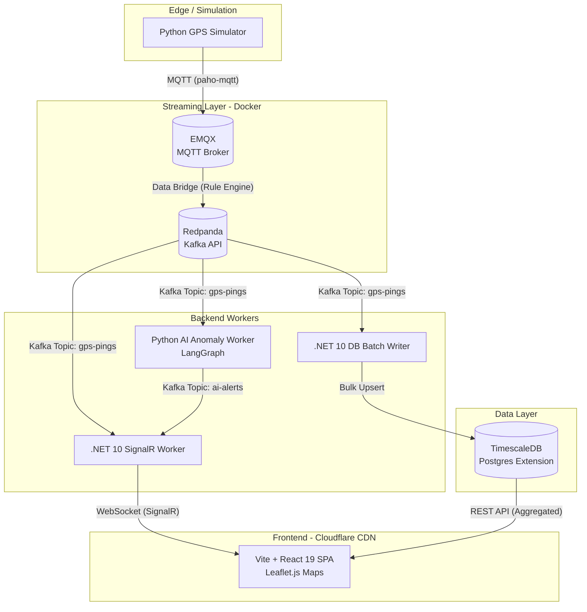
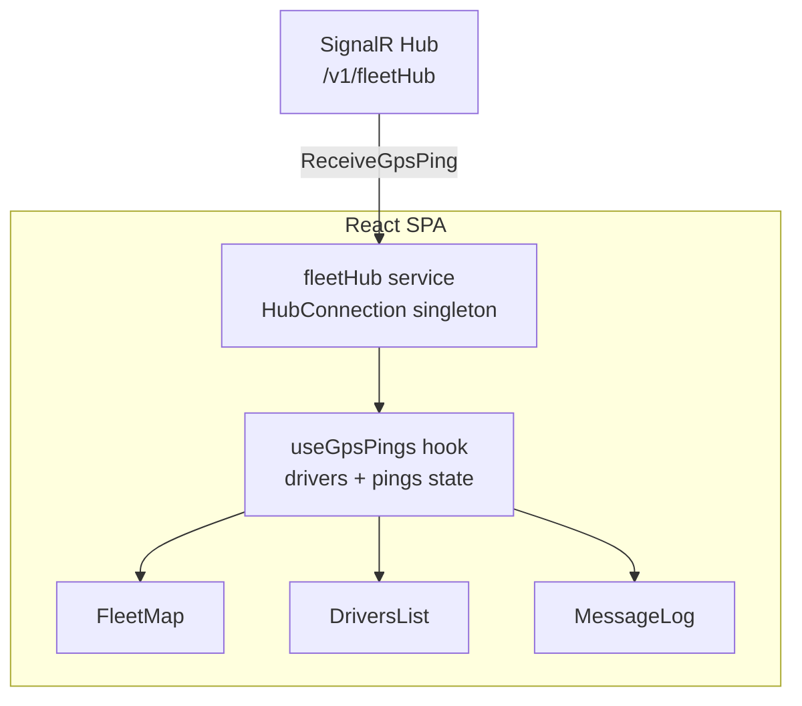
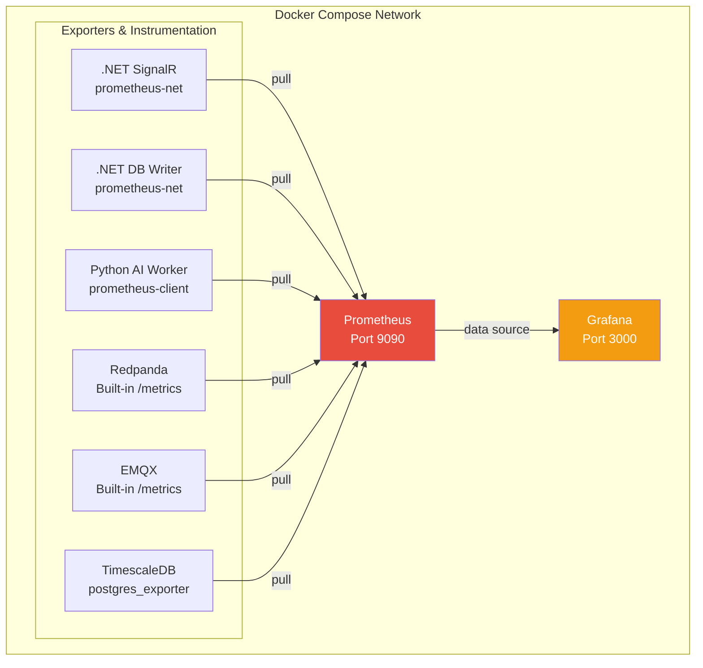

# FleetPulse System

## Document Revision

| Version | Date | Author | Description
| :--- | :--- | :--- | :--- |
| 1.0 | 2026-07-08 | jose valdes | Created: Architectural document created |
| 1.1 | 2026-07-09 | jose valdes | Added: native MQTT proxy was deprecated inside redpanda. EMQX Broker container is added to receive MQTT messages and forward them to RedPanda |


# Architecture
## Overview
FleetPulse is a real-time, AI-powered logistics control tower designed to monitor a simulated fleet of delivery motorcycles. It demonstrates a high-throughput, event-driven architecture capable of ingesting high-frequency GPS telemetry, analyzing it for anomalies via LLMs, and visualizing it dynamically on a live map.

This project highlights modern distributed systems concepts: Stream Processing, Micro-batching, Temporal Data Compression, and Decoupled Backend Workers.

## High-Level Architecture
The system follows a strict fan-out pattern. Edge devices (simulated) publish telemetry to a stream broker. Independent backend services consume the stream concurrently based on their domain responsibility. The frontend operates as a pure SPA, receiving real-time pushes via WebSockets.


```mermaid
graph TD

subgraph Edge [Edge / Simulation]
Sim[Python GPS Simulator]
end

subgraph Stream [Streaming Layer - Docker]
EMQX[(EMQX <br/> MQTT Broker)]
RP[(Redpanda <br/> Kafka API)]
EMQX -- "Data Bridge (Rule Engine)" --> RP
end

subgraph Processing [Backend Workers]
WS[.NET 10 SignalR Worker]
AI[Python AI Anomaly Worker <br/> LangGraph]
DB[.NET 10 DB Batch Writer]
end
subgraph Storage [Data Layer]
TSDB[(TimescaleDB <br/> Postgres Extension)]
end
subgraph Presentation [Frontend - Cloudflare CDN]
UI[Vite + React 19 SPA <br/> Leaflet.js Maps]
end

Sim -- "MQTT (paho-mqtt)" --> EMQX
RP -- "Kafka Topic: gps-pings" --> WS
RP -- "Kafka Topic: gps-pings" --> AI
RP -- "Kafka Topic: gps-pings" --> DB

AI -- "Kafka Topic: ai-alerts" --> WS
DB -- "Bulk Upsert" --> TSDB
WS -- "WebSocket (SignalR)" --> UI
TSDB -- "REST API (Aggregated)" --> UI


```

## Technology Stack & Rationale
| Layer | Technology | Architectural Rationale |
| :--- | :--- | :--- |
| **Telemetry Ingestion** | Python + `paho-mqtt` | MQTT is the industry standard for IoT/edge devices due to minimal bandwidth and battery overhead. |
| **MQTT Broker** | EMQX Broker (Docker) | MQTT broker for IoT that nativily integrates to Kafka-compatible RedPanda. |
| **Message Broker** | Redpanda (Docker) | Native Kafka API compatibility.  |
| **Real-Time Push** | .NET 10 Worker + SignalR | Maintains persistent WebSocket state. SignalR Groups natively handle routing updates to specific fleet managers. |
| **AI / Analytics** | Python + `aiokafka` + LangGraph | Decoupled async worker. Consumes streams without blocking, uses LLMs for contextual anomaly explanations. |
| **Data Storage** | PostgreSQL + TimescaleDB | Relational reliability for transactions, combined with TimescaleDB's `Hypertables` for high-performance time-series compression and `time_bucket()` aggregations. |
| **Frontend** | Vite + React 19 + TS | Pure SPA. Server-Side Rendering (Next.js) is intentionally avoided as real-time data is stale the moment it's rendered. Vite provides superior HMR for map UI tuning. |
| **Deployment (FE)** | Cloudflare Pages | Static assets served at the edge. Zero cold starts, zero cost, inherently secure. |
| **Deployment (BE)** | Docker Compose (Local) <br> AWS ECS / Azure Container Apps (Prod) | Containerized workloads allow independent scaling of the AI worker vs. the DB writer based on load. |
| **DB Batch Writer** | .NET DB Batch Writer (background service) | Fast developement with Dapper + inline SQL. Using Npgsql library  |
|
## Architectural Deep Dives

1. The Database Ingestion Pipeline (DB Batch Writer)
Writing 250 individual GPS pings per second directly to a relational database causes severe I/O bottlenecks and lock contention. The DB Writer solves this using a 3-stage pipeline:

Micro-Batching: The worker consumes the Kafka stream but holds GPS pings in an in-memory buffer, flushing to the database in bulk every 5 seconds (or at 1,000 records). This turns 250 I/O ops/sec into ~25 bulk ops/sec.
Temporal Compression: Before flushing, the logic drops redundant data. If a driver is stopped at a red light for 30 seconds, only the first and last ping are kept. Moving highway pings are down-sampled to 1 point per 15 seconds.
Dual-Table Write Strategy:
gps_history (Hypertable): Receives the bulk-inserted, compressed historical data. TimescaleDB automatically compresses data older than 7 days to save ~90% disk space.
driver_latest_state (Standard Table): Receives a continuous UPSERT. This table strictly contains exactly one row per active driver (e.g., 500 rows), allowing the frontend to query current locations in milliseconds without scanning millions of historical rows.
2. Frontend Architecture: Why a Pure SPA?
A common question is why this project uses Vite + React instead of Next.js (which was used in the companion e-commerce project).

Stale Data Problem: Next.js Server Components render HTML on the server. By the time the HTML reaches the browser, the GPS coordinates have already changed. SSR provides zero value for live moving objects.
Connection State: WebSockets require long-lived, stateful connections. Next.js Serverless functions (Vercel) aggressively terminate idle connections and enforce strict timeouts.
Performance: Vite's Hot Module Replacement (HMR) is nearly instantaneous, which is critical when iterating on complex map animations and real-time chart state.
3. Decoupled AI Alerting
The AI worker does not push alerts directly to the frontend. Instead, it evaluates the gps-pings stream, and if an anomaly is detected (e.g., a driver is stationary in a high-risk zone), it publishes a new event to a separate Kafka topic: ai-alerts.

The SignalR Worker subscribes to both topics (gps-pings and ai-alerts) and acts as the single gateway to the browser. This ensures the frontend remains completely agnostic to how many backend workers are processing data behind the scenes.
	   

## Database Access 

```
[ Redpanda Topic: "gps-pings" ]
       │
       ▼
[ .NET DB Batch Writer (Background Service) ]
       │
       ├──> 1. In-Memory Buffer (holds for 5 seconds)
       │
       ├──> 2. Compression Logic (drops stopped-driver duplicates)
       │
       ├──> 3. Bulk INSERT -> TimescaleDB `gps_history` table (Hypertable)
       │
       └──> 4. UPSERT -> TimescaleDB `driver_latest_state` table (500 rows)
```


## Local Development Topology
During local development, the entire distributed system is orchestrated via a single docker-compose.yml file, ensuring zero friction for developers cloning the repository.

```
┌─────────────────────────────────────────────────────────┐
│                  Docker Compose Network                 │
│                                                         │
│  ┌─────────────┐  ┌─────────────┐  ┌──────────────────┐ │
│  │  EMQX       │  │ .NET SignalR│  │ Python AI Worker │ │
│  │ (MQTT Broker│  │   Worker    │  │   (LangGraph)    │ │
│  └──────┬──────┘  └─────┬───────┘  └──────────────────┘ │
│         │               │                               │
│         │ Data Bridge   │                               │
│         ▼               │                               │
│  ┌────────────┐         │                               │
│  │  Redpanda  │<>───────┘                               │
│  │ (Kafka API)│                                         │
│  └──────┬─────┘                                         │
│         │                                               │
│  ┌──────┴─────┐  ┌────────────┐                         │
│  │TimescaleDB │<>│ .NET DB    │                         │
│  │  (Postgres)│  │   Writer   │                         │
│  └────────────┘  └────────────┘                         │
└─────────────────────────────────────────────────────────┘
         ▲                              ▲
         │                              │
    [Python Simulator]            [Vite React SPA]
    (Runs on host)                (Runs on host :5173)
```
	
## Repository Structure

```SQL
-- Hypertable for historical GPS data
CREATE TABLE gps_history (
    driver_id      VARCHAR(50) NOT NULL,
    timestamp      TIMESTAMPTZ NOT NULL,
    latitude       DOUBLE PRECISION NOT NULL,
    longitude      DOUBLE PRECISION NOT NULL,
    speed          DOUBLE PRECISION,
    heading        INTEGER,
    accuracy       DOUBLE PRECISION,
    raw_payload    JSONB
);

-- Latest state table (one row per driver)
CREATE TABLE driver_latest_state (
    driver_id      VARCHAR(50) PRIMARY KEY,
    latitude       DOUBLE PRECISION NOT NULL,
    longitude      DOUBLE PRECISION NOT NULL,
    speed          DOUBLE PRECISION,
    heading        INTEGER,
    last_seen      TIMESTAMPTZ NOT NULL,
    status         VARCHAR(20) DEFAULT 'moving'  -- moving, stopped, offline
);
```


## Data Models
** MQTT message model

```JSON
	message = {
		"driver_id": "string"
		"timestamp": "datetime - isoformat",
		"latitude": "float",
		"longitude": "float",
		"speed_kmh": "int",
		"heading_degrees": "float",
		"accuracy_meters": "float",
		"status": "string" "decelerating" else "moving",
		"vehicle_type": "string",
	}
```

```
	message = {
		"driver_id": self.config.driver_id,
		"timestamp": datetime.now(timezone.utc).isoformat(),
		"latitude": round(lat, 6),
		"longitude": round(lng, 6),
		"speed_kmh": round(self.current_speed_kmh, 1),
		"heading_degrees": round(self.heading, 1),
		"accuracy_meters": round(abs(random.gauss(4.0, 1.5)), 1),
		"status": self.status if self.status != "decelerating" else "moving",
		"vehicle_type": self.config.vehicle_type,
	}
	
```

** .net DbBatchWriterWorker Data Model
```c#
 public class GpsPing
 {
     public int Id { get; set; }

     [JsonPropertyName("driver_id")]
     public string DriverId { get; init; } = string.Empty;

     [JsonPropertyName("latitude")]
     public double Latitude { get; init; }

     [JsonPropertyName("longitude")]
     public double Longitude { get; init; }

     [JsonPropertyName("speed_kmh")]
     public double Speed { get; set; }

     [JsonPropertyName("heading_degrees")]
     public double Heading { get; init; }

     [JsonPropertyName("accuracy_meters")]
     public double Accuracy { get; init; }

     [JsonPropertyName("status")]
     public string Status { get; init; } = string.Empty;

     [JsonPropertyName("vehicle_type")]
     public string? VehicleType { get; init; }

     [JsonPropertyName("timestamp")]
     public DateTimeOffset Timestamp { get; init; }

     [JsonIgnore]
     public string? RawPayloadJson { get; set; }

 }
 
 public class DriverLastState
 {
     public string Driver_Id { get; set; } = string.Empty;

     public double Latitude { get; set; }

     public double Longitude { get; set; }

     public double Speed { get; set; }

     public double Heading { get; set; }

     public DateTimeOffset Last_Seen { get; set; }

     public string Status { get; set; } = string.Empty;

 }
 
```

## DbBatchWriterWorker

```
┌─────────────────────────────────────────────────────────────────┐
│                    DbBatchWriterWorker                          │
│                                                                 │
│  ┌─────────────────────┐     ┌──────────────────────────────┐   │
│  │ RedpandaConsumer    │     │  Flush Loop (every 5s)       │   │
│  │ Service             │     │                              │   │
│  │                     │     │  1. GetBatchedPings()        │   │
│  │  Consume() ────────►│     │  2. Compress (TODO)          │   │
│  │       │             │     │  3. BulkInsert (TODO)        │   │
│  │       ▼             │     │  4. UpsertLatest (TODO)      │   │
│  │  ┌──────────────┐   │     │  5. ClearBatch()             │   │
│  │  │  Concurrent  │   │     └──────────────────────────────┘   │
│  │  │  Bag<GpsPing>│   │                                        │
│  │  │  (Buffer)    │   │                                        │
│  │  └──────────────┘   │                                        │
│  └─────────────────────┘                                        │
└─────────────────────────────────────────────────────────────────┘
```


## SignalR Worker - FleetPulse.SignalRHub

The `FleetPulse.SignalRHub` is an ASP.NET Core 10 Minimal API + SignalR server. It has two responsibilities:

1. **Real-time push** – A `BackgroundService` (`GpsPingConsumer`) consumes the `gps-pings` Kafka topic and fans every deserialized ping out to all connected browser clients over WebSockets.
2. **REST query layer** – A set of Minimal API endpoints let the SPA bootstrap its state on load (latest driver positions, GPS history, AI alerts) by reading directly from TimescaleDB via Dapper + Npgsql.

### Architecture

```
┌──────────────────────────────────────────────────────────────────┐
│                        FleetPulse.SignalRHub                     │
│                                                                  │
│  ┌────────────────────────────┐    ┌──────────────────────────┐  │
│  │  GpsPingConsumer           │    │  FleetHub (SignalR)      │  │
│  │  (BackgroundService)       │    │                          │  │
│  │                            │    │  SubscribeFleet(fleetId) │  │
│  │  Kafka Topic: gps-pings    │    │  UnsubscribeFleet(...)   │  │
│  │       │                    │    │                          │  │
│  │       ▼                    │    │  Group: "fleet:{id}"     │  │
│  │  Deserialize MessageWrapper│    └──────────────────────────┘  │
│  │       │                    │              ▲                   │
│  │       ▼                    │              │                   │
│  │  Throttle (max 2 Hz /      │──SendAsync──►│ IHubContext       │
│  │   driver, 500 ms window)   │  ReceiveGpsPing                  │
│  └────────────────────────────┘                                  │
│                                                                  │
│  ┌──────────────────────────────────────────────────────────┐    │
│  │  REST Endpoints (Minimal API, v1)                        │    │
│  │                                                          │    │
│  │  GET /api/v1/drivers?from=<datetime>                     │    │
│  │  GET /api/v1/drivers/{id}/history?from=&to=              │    │
│  │  GET /api/v1/alerts?from=&to=&limit=                     │    │
│  └────────────────┬─────────────────────────────────────────┘    │
│                   │  Dapper + Npgsql                             │
│                   ▼                                              │
│            TimescaleDB (PostgreSQL)                              │
└──────────────────────────────────────────────────────────────────┘
```

### Default API Version

`v1`

### REST Endpoints

| Method | Path | Query params | Description |
| :--- | :--- | :--- | :--- |
| `GET` | `/` | — | Welcome message |
| `GET` | `/health` | — | Health probe |
| `GET` | `/dbversion` | — | Returns the connected PostgreSQL version string |
| `GET` | `/api/v1/drivers` | `from` (DateTime) | Returns the latest state of all drivers active after `from` |
| `GET` | `/api/v1/drivers/{id}/history` | `from`, `to` (DateTime) | Returns the GPS track of a single driver between two timestamps |
| `GET` | `/api/v1/alerts` | `from`, `to` (DateTime), `limit` (int, default 50) | Returns AI-generated alerts within the time window |

### Response Contracts

**`LastestDriverStateResponse`** – returned by `/api/v1/drivers`
```json
{
  "driverId":  "string",
  "latitude":  0.0,
  "longitude": 0.0,
  "speed":     0.0,
  "heading":   0.0,
  "lastSeen":  "string (ISO-8601)",
  "status":    "string"
}
```

**`GpsHistoryResponse`** – returned by `/api/v1/drivers/{id}/history`
```json
{
  "driverId":  "string",
  "latitude":  0.0,
  "longitude": 0.0,
  "speed":     0.0,
  "heading":   0.0,
  "timestamp": "string (ISO-8601)"
}
```

**`AlertResponse`** – returned by `/api/v1/alerts`
```json
{
  "id":          "string",
  "driverId":    "string",
  "alertType":   "string",
  "severity":    "string",
  "description": "string",
  "context":     "string",
  "createdAt":   "string (ISO-8601)"
}
```

### SignalR Hub

| Property | Value |
| :--- | :--- |
| Hub URI | `/v1/fleetHub` |
| Server → Client callback | `ReceiveGpsPing` |
| Payload | `GpsPingDto` (see below) |

Clients can subscribe to a specific fleet's updates to receive targeted pushes in the future (group-based fan-out is wired; the current implementation broadcasts to `Clients.All`):

```js
// Connect
const conn = new signalR.HubConnectionBuilder().withUrl("/v1/fleetHub").build();

// Subscribe to fleet updates
await conn.invoke("SubscribeFleet", "fleet-42");

// Receive real-time GPS pings
conn.on("ReceiveGpsPing", (ping) => { /* update map marker */ });
```

**`GpsPingDto`** – pushed by `ReceiveGpsPing`
```json
{
  "driver_id":        "string",
  "latitude":         0.0,
  "longitude":        0.0,
  "speed_kmh":        0.0,
  "heading_degrees":  0.0,
  "accuracy_meters":  0.0,
  "status":           "string",
  "vehicle_type":     "string | null",
  "timestamp":        "string (ISO-8601)"
}
```

### Kafka / Message Envelope

Messages on the `gps-pings` topic are wrapped in a `MessageWrapper` envelope before the actual ping payload:

```json
{
  "kafka_key":  "string",
  "client_id":  "string",
  "payload":    "<JSON-encoded GpsPingDto>"
}
```

`GpsPingConsumer` unwraps the envelope and deserializes the inner `payload` field before forwarding to clients.

### Throttling (Back-pressure)

To prevent overwhelming the browser with high-frequency updates, `GpsPingConsumer` enforces a **per-driver rate limit of 2 Hz (500 ms minimum interval)**. Messages that arrive faster than this cadence for a given driver are silently dropped on the server side.

### CORS

In development mode the server allows credentials from the Vite SPA at `http://localhost:5173`. Credentials must be allowed because SignalR uses cookies/tokens for the WebSocket handshake.

### Configuration (`appsettings.json`)

```json
{
  "ConnectionStrings": {
    "FleetPulseDb": "Host=timescaledb-1;Port=5432;Database=fleetpulse;Username=...;Password=..."
  },
  "Kafka": {
    "BootstrapServers": "localhost:19092",
    "GroupId":          "fleetpulse-hub-consumer",
    "Topic":            "gps-pings",
    "AutoOffsetReset":  "Earliest",
    "EnableAutoCommit": "true"
  },
  "SignalR": {
    "CallbackMethod": "ReceiveGpsPing"
  }
}
```

### Design Decisions

| Decision | Rationale |
| :--- | :--- |
| `BackgroundService` for Kafka consumption | Ties the consumer lifecycle to the ASP.NET host; clean startup/shutdown with `CancellationToken` propagation. Consumer runs on a `Task.Run` thread-pool thread so it does not block app startup. |
| Minimal API instead of MVC controllers | Reduces ceremony for a thin read-only query layer; keeps the service boundary explicit. |
| Mapster for DTO → Response mapping | Zero-reflection mapping configuration with compile-time safety; registered once at startup via `MappingConfig.RegisterMappings()`. |
| Dapper over EF Core | TimescaleDB queries are hand-crafted SQL (time-series aggregations). Dapper gives full SQL control without the overhead of an ORM change-tracker. |
| `NpgsqlDataSource` singleton | Handles connection pooling internally; a single `NpgsqlDataSource` is the recommended usage pattern for Npgsql 7+. |
| Global exception handler (`IExceptionHandler`) | Centralises ProblemDetails error responses; maps `ValidationException` → 422 and `UnauthorizedAccessException` → 401, everything else → 500. |
| Per-driver throttle (2 Hz) in-process | Avoids saturating the SignalR backplane and the browser event loop when GPS simulators produce bursts. A sliding-window `Dictionary<string, DateTimeOffset>` is sufficient for a single-instance deployment. |


## Fleet.Pulse.Frontend

The `FleetPulse.Frontend` is a React 19 + TypeScript Single-Page Application built with Vite. Its primary purpose is to visualize real-time driver telemetry pushed by the SignalR hub and present it in three synchronized views:

1. **Map view** (live geospatial position)
2. **Driver roster** (operational status by driver)
3. **Raw event log** (recent ping stream for observability/debugging)

### Frontend Runtime Architecture


```mermaid
graph TD

Hub[SignalR Hub<br/>/v1/fleetHub]

subgraph Browser[React SPA]
Service[fleetHub service<br/>HubConnection singleton]
Hook[useGpsPings hook<br/>drivers + pings state]
Map[FleetMap]
List[DriversList]
Log[MessageLog]
end

Hub -- "ReceiveGpsPing" --> Service
Service --> Hook
Hook --> Map
Hook --> List
Hook --> Log
```

### Functional Responsibilities

| Area | Implementation | Responsibility |
| :--- | :--- | :--- |
| **Transport** | `@microsoft/signalr` | Maintains a persistent WebSocket connection to the backend hub (`/v1/fleetHub`). |
| **Connection Lifecycle** | `fleetHub` service | Handles connect/start, automatic reconnect backoff, receive callback registration (`ReceiveGpsPing`), and optional group subscription (`SubscribeFleet`). |
| **State Aggregation** | `useGpsPings` hook | Builds in-memory state from stream events: latest ping per driver (`drivers`) and rolling event history (`pings`, capped to 200). |
| **Geospatial Visualization** | `react-leaflet` + OpenStreetMap | Renders one marker per active driver with popup metadata (driver, speed, status). |
| **Operational UI** | `DriversList`, `MessageLog` | Exposes status and traceability views for operators during simulation. |

### Data Contracts Used by the SPA

The frontend consumes `GpsPing` payloads pushed by SignalR:

```json
{
  "driver_id": "string",
  "latitude": 0.0,
  "longitude": 0.0,
  "speed_kmh": 0.0,
  "heading_degrees": 0.0,
  "accuracy_meters": 0.0,
  "status": "moving|stopped|...",
  "vehicle_type": "string|null",
  "timestamp": "ISO-8601"
}
```

### UI Composition

The current layout is a 3-panel operational console:

- Left panel: driver list + status badges
- Center panel: live map viewport (`~60vh`) with markers
- Right panel: scrolling raw ping log (textarea, monospace)

This layout is optimized for rapid local debugging of stream quality and real-time behavior rather than for polished dashboard aesthetics.

### Connection and Resilience Strategy

- Automatic reconnect strategy: `[0, 2000, 5000, 10000, 30000]` ms retry delays
- Credentials enabled in WebSocket handshake (`withCredentials: true`) to align with backend CORS policy
- Event fan-out pattern on client: one SignalR callback dispatches to local subscribers
- Rolling memory cap (`MAX_PINGS = 200`) prevents unbounded growth in browser memory

### Configuration

The hub URL is environment-driven via Vite:

```env
VITE_FLEET_HUB_URL=http://localhost:xxxx/v1/fleetHub
```

This keeps frontend deployment flexible across local Docker, staging, and production endpoints without code changes.

### Design Decisions

| Decision | Rationale |
| :--- | :--- |
| Pure SPA (no SSR) | Telemetry is high-frequency and quickly stale; client-side rendering is the correct tradeoff for live coordinates. |
| SignalR for push channel | Simplifies browser real-time networking and reconnect behavior over raw WebSocket management. |
| Hook-based state (`useGpsPings`) | Keeps stream processing logic isolated from rendering components. |
| Leaflet + OSM tiles | Lightweight open mapping stack, easy to run locally without vendor lock-in. |
| Dedicated map/list/log views | Supports both operations visibility and low-level debugging during simulator bursts. |

### Frontend Dependencies (Current)

Core runtime libraries:

- `react`, `react-dom`
- `@microsoft/signalr`
- `leaflet`, `react-leaflet`
- `recharts` (available for analytics widgets)

Build and styling toolchain:

- `vite`, `typescript`
- `tailwindcss`, `@tailwindcss/vite`, `postcss`, `autoprefixer`


## AI-Worker

The AI worker is a Python-based streaming service that listens to vehicle GPS events, detects when a driver leaves their assigned working zone, and publishes an AI-assisted alert for downstream consumers.

### Current implementation

- AI platform: Azure OpenAI, accessed through `langchain_openai` with Azure authentication.
- Input stream: the worker consumes GPS pings from the Kafka/Redpanda topic `gps-pings`.
- Detection logic: a `WorkingZoneViolationDetector` compares the previous and current GPS points for a driver and raises a violation when the driver moves from inside to outside their assigned zone polygon.
- Geospatial context: zone polygons are loaded from the repository data directory, including `data/allowed_zones/*.geojson` and `data/driver_zones_mapping.json`.
- AI analysis: once a violation is detected, an `AlarmAnalyzerAgent` evaluates the event and returns a structured response with `risk_level`, `assessment`, `recommended_action`, and `auto_escalate`.
- Alert publishing: an `AlertManager` publishes the resulting alert to the configured output topic (currently defaulting to `alerts`; older project references may still use `ai-alerts`).

### Processing flow

1. Consume a GPS ping from `gps-pings`.
2. Keep a short rolling history per driver (up to 10 pings).
3. Detect a working-zone violation using the latest two points in that history.
4. Send the violation context to the Azure OpenAI agent for assessment.
5. Publish the enriched alert event for downstream processing.

### Key components

- `fleetpulse_ai/main.py`: worker entry point and orchestration flow.
- `fleetpulse_ai/detectors/working_zone_violation.py`: rule-based violation detection.
- `fleetpulse_ai/agents/alarm_analyzer_agent.py`: Azure OpenAI-based alert assessment.
- `fleetpulse_ai/managers/kafka_consumer.py` and `fleetpulse_ai/managers/alert_manager.py`: Kafka/Redpanda input/output integration.
- `fleetpulse_ai/settings.py`: runtime configuration for Azure OpenAI, Kafka broker settings, and topic names.

### Notes

This is currently a rules-plus-LLM workflow rather than a fully autonomous multi-agent system. The core behavior is already implemented and is designed to evolve as the alerting heuristics become more sophisticated.


## Prometheus + Grafana Implementation
### Architecture

```mermaid
graph TD
    subgraph "Docker Compose Network"
        P[Prometheus<br/>Port 9090]
        G[Grafana<br/>Port 3000]
        
        subgraph "Exporters & Instrumentation"
            RED[Redpanda<br/>Built-in /metrics]
            EMQX[EMQX<br/>Built-in /metrics]
            TSDB[TimescaleDB<br/>postgres_exporter]
            NET1[.NET SignalR<br/>prometheus-net]
            NET2[.NET DB Writer<br/>prometheus-net]
            PY[Python AI Worker<br/>prometheus-client]
        end
    end
    
    NET1 -->|pull| P
    NET2 -->|pull| P
    PY -->|pull| P
    RED -->|pull| P
    EMQX -->|pull| P
    TSDB -->|pull| P
    P -->|data source| G
    
    style P fill:#e74c3c,color:#fff
    style G fill:#f39c12,color:#fff
```


### Observability Stack

FleetPulse includes a lightweight Prometheus + Grafana observability stack for local development and production pattern demonstration.

### Quick Start

```bash
# Infrastructure is included in docker-compose.yml and docker-compose-obsv
docker compose up -d prometheus grafana postgres-exporter

# Access
# Prometheus: http://localhost:9090
# Grafana:    http://localhost:3000  (admin / fleetpulse)
```

### Prometheus Implementation

FleetPulse includes a Prometheus and Grafana stack for observing the broker, workers, and database components during local development and demo runs. Prometheus collects application and infrastructure metrics from the stream processors, and Grafana is used to visualize dashboards and alerts.

For implementation details, scrape configuration, and example metric definitions, see [README_PROMETHEUS.md](README_PROMETHEUS.md).

#### What Prometheus Monitors

| Service | What is exposed | Default endpoint or path |
| :--- | :--- | :--- |
| Redpanda | Broker and Kafka-style stream metrics | Built-in metrics at `/public_metrics` |
| EMQX | MQTT broker health and message flow metrics | Built-in metrics at `/api/v5/prometheus/stats` |
| TimescaleDB | Database exporter metrics | `postgres-exporter` at `/metrics` |
| SignalR hub | Real-time WebSocket and Kafka consumer metrics | ASP.NET app metrics at `/metrics` |
| DB writer | Batch ingestion and database flush metrics | ASP.NET app metrics at `/metrics` |
| AI worker | AI workflow, alerting, and consumer lag metrics | Python metrics endpoint at `/metrics` |

#### Key Metrics

| Component | Metric | Type | Labels | Meaning |
| :--- | :--- | :--- | :--- | :--- |
| AI worker | fleetpulse_ai_pings_received_total | Counter | none | Total GPS pings received from Kafka. |
| AI worker | fleetpulse_ai_pings_processed_total | Counter | anomaly_detected | Total pings evaluated by the AI worker, split by anomaly outcome. |
| AI worker | fleetpulse_ai_anomaly_detection_seconds | Histogram | anomaly_type | Time spent analyzing a ping for an anomaly. |
| AI worker | fleetpulse_ai_alerts_published_total | Counter | severity | Alerts published by the AI workflow, grouped by severity. |
| AI worker | fleetpulse_ai_kafka_lag_messages | Gauge | none | Estimated consumer lag for the AI worker. |
| DB writer | fleetpulse_dbwriter_gps_pings_received_total | Counter | topic | GPS pings consumed from the stream, grouped by topic. |
| DB writer | fleetpulse_dbwriter_gps_pings_compressed_to_db_total | Counter | none | GPS pings compressed and written to TimescaleDB. |
| DB writer | fleetpulse_dbwriter_db_flush_duration_seconds | Histogram | none | Time spent flushing a batch to the database. |
| SignalR hub | fleetpulse_signalrhub_gps_pings_received_total | Counter | topic | GPS pings consumed by the hub from Kafka. |
| SignalR hub | fleetpulse_signalrhub_alerts_received_total | Counter | topic | Alert messages consumed by the hub from Kafka. |
| SignalR hub | fleetpulse_signalrhub_active_drivers | Gauge | none | Number of unique drivers seen in the last 5 minutes. |
| SignalR hub | fleetpulse_signalrhub_connected_clients | Gauge | none | Current number of connected SignalR clients. |
| SignalR hub | fleetpulse_signalrhub_authentication_errors_total | Counter | none | Authentication failures encountered by the hub. |

#### Alerting Rules

| Alert | Severity | Trigger | What it means |
| :--- | :--- | :--- | :--- |
| HighConsumerLag | warning | Redpanda consumer group lag stays above 1000 for 2 minutes | Kafka consumption is falling behind. |
| NoGpsPingsReceived | critical | GPS ping rate is zero for 2 minutes | The live GPS stream appears to have stopped. |
| HighDbFlushLatency | warning | 99th percentile DB flush time exceeds 0.5 seconds for 5 minutes | Batch writes to TimescaleDB are slowing down. |
| SignalRNoClients | info | No clients are connected for 1 minute | No frontend users are currently viewing the live feed. |

#### Common Endpoints

| Component | Route | Purpose |
| :--- | :--- | :--- |
| Prometheus | `http://localhost:9090` | Query metrics and inspect active targets. |
| Grafana | `http://localhost:3000` | View dashboards and alert status. |

Prometheus is wired through Docker Compose using the observability files under `docker/observability/`. The stack is intended for local visibility, but it also mirrors the shape of a production monitoring setup.


### Log Management: LOKI + PromTail

| Component | Route | Purpose |
| :--- | :--- | :--- |
| promtail  | none | Agent to collect logs from containers |
| Loki  | `http://localhost:3100` | Logs storage and data source for grafana |


```text
┌─────────────────────────────────────────────────────────┐
│                  Docker Compose Network                 │
│                                                         │
│  ┌─────────────┐  ┌─────────────┐  ┌──────────────────┐ │
│  │  EMQX       │  │ .NET SignalR│  │ Python AI Worker │ │
│  │             │  │   Worker    │  │                  │ │
│  └──────┬──────┘  └─────┬───────┘  └────────┬─────────┘ │
│         │               │                   │           │
│         │ stdout        │ stdout            │ stdout    │
│         ▼               ▼                   ▼           │
│  ┌──────────────────────────────────────────────────┐   │
│  │              Promtail (agent)                    │   │
│  │  Discovers containers via Docker socket          │   │
│  └──────────────────────┬───────────────────────────┘   │
│                         │ HTTP push                     │
│                         ▼                                │
│  ┌──────────────────────────────────────────────────┐   │
│  │              Loki (port 3100)                    │   │
│  └──────────────────────┬───────────────────────────┘   │
│                         │ data source                   │
│                         ▼                                │
│                  ┌──────────────┐                       │
│                  │   Grafana    │                       │
│                  │  (existing)  │                       │
│                  └──────────────┘                       │
└─────────────────────────────────────────────────────────┘
```

Log Schema for ai-worker service:
```json
{
  "timestamp": "2026-07-10T12:34:56.789Z",
  "level": "INFO",
  "logger": "fleetpulse_ai.managers.kafka_consumer",
  "service": "db-writer",
  "version": "1.0.0",
  "message": "Flushed batch to TimescaleDB",
  "driver_id": "DRV-042", 
  "duration_ms": 38,
  "other_properties": "add other properties here as needed"
}
```

* Python logging library: structlog

* .Net logging library: Serilog, Serilog.Sinks.Console
 

