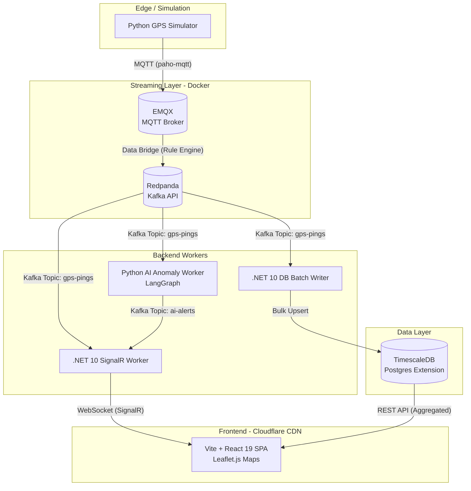

# FleetPulse System

## Document Revision

| Version | Date | Author | Description
| :--- | :--- | :--- | :--- |
| 1.0 | 2026-07-08 | jose valdes | Created: Architectural document created |
| 1.1 | 2026-07-09 | jose valdes | Added: native MQTT proxy was deprecated inside redpanda. EMQX Broker container is added to receive MQTT messages and forward them to RedPanda |
| 1.2 | 2026-08-26 | jose valdes | Refactor documentation. Partial work | 


# Architecture

## Overview
FleetPulse is a real-time, AI-powered logistics control tower designed to monitor a simulated fleet of delivery motorcycles. It demonstrates a high-throughput, event-driven architecture capable of ingesting high-frequency GPS telemetry, analyzing it for anomalies via LLMs, and visualizing it dynamically on a live map.

This project highlights modern distributed systems concepts: Stream Processing, Micro-batching, Temporal Data Compression, and Decoupled Backend Workers.

## High-Level Architecture
The system follows a strict fan-out pattern. Edge devices (simulated) publish telemetry to a stream broker. Independent backend services consume the stream concurrently based on their domain responsibility. The frontend operates as a pure SPA, receiving real-time pushes via WebSockets.


```mermaid
graph TD

subgraph Edge [Edge / Simulation]
Sim[Python GPS Simulator]
end

subgraph Stream [Streaming Layer - Docker]
EMQX[(EMQX <br/> MQTT Broker)]
RP[(Redpanda <br/> Kafka API)]
EMQX -- "Data Bridge (Rule Engine)" --> RP
end

subgraph Processing [Backend Workers]
WS[.NET 10 SignalR Worker]
AI[Python AI Anomaly Worker <br/> LangGraph]
DB[.NET 10 DB Batch Writer]
end
subgraph Storage [Data Layer]
TSDB[(TimescaleDB <br/> Postgres Extension)]
end
subgraph Presentation [Frontend - Cloudflare CDN]
UI[Vite + React 19 SPA <br/> Leaflet.js Maps]
end

Sim -- "MQTT (paho-mqtt)" --> EMQX
RP -- "Kafka Topic: gps-pings" --> WS
RP -- "Kafka Topic: gps-pings" --> AI
RP -- "Kafka Topic: gps-pings" --> DB

AI -- "Kafka Topic: ai-alerts" --> WS
DB -- "Bulk Upsert" --> TSDB
WS -- "WebSocket (SignalR)" --> UI
TSDB -- "REST API (Aggregated)" --> UI


```
 ** More details in folder ".docs/"


## Documentation Index
Detailed documentation has been split by domain and service.

### Global Architecture & Contracts
 * Architecture & Deep Dives
* Data Contracts (DB Schemas, Kafka Messages)
* Observability (Prometheus, Loki, OpenTelemetry)

### Services
* SignalR Hub (Real-time Push & REST API)
* DB Batch Writer (Ingestion & Compression)
* AI Anomaly Worker (LangGraph & LLMs)
* Frontend (React 19 + Vite SPA)

### Local Development Topology
During local development, the entire distributed system is orchestrated via a single docker-compose.yml file, ensuring zero friction for developers cloning the repository.

```
┌──────────────────────────────────────────────────────────┐
│                  Docker Compose Network                  │
│                                                          │
│  ┌──────────────┐  ┌─────────────┐  ┌──────────────────┐ │
│  │  EMQX        │  │ .NET SignalR│  │ Python AI Worker │ │
│  │ (MQTT Broker)│  │   Worker    │  │   (LangGraph)    │ │
│  └──────┬───────┘  └─────┬───────┘  └──────────────────┘ │
│         │               │                                │
│         │ Data Bridge   │                                │
│         ▼               │                                │
│  ┌────────────┐         │                                │
│  │  Redpanda  │<>───────┘                                │
│  │ (Kafka API)│                                          │
│  └──────┬─────┘                                          │
│         │                                                │
│  ┌──────┴─────┐  ┌────────────┐                          │
│  │TimescaleDB │<>│ .NET DB    │                          │
│  │  (Postgres)│  │   Writer   │                          │
│  └────────────┘  └────────────┘                          │
└──────────────────────────────────────────────────────────┘
         ▲                              ▲
         │                              │
    [Python Simulator]            [Vite React SPA]
    (Runs on host)                (Runs on host :5173)
```

### Quick Start
run the "./docker/docker-compose.yml" file using:
 docker compose up -d

run the python simulator inside the "./simulator":
> python main.py

