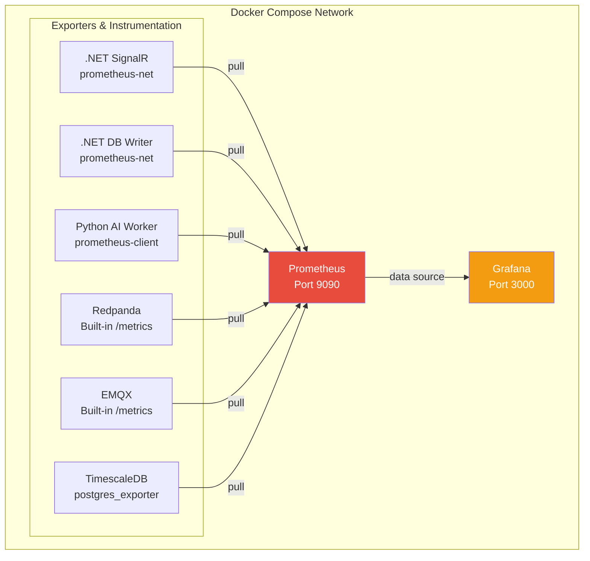

## Prometheus + Grafana Implementation
### Architecture



### Observability Stack

FleetPulse includes a lightweight Prometheus + Grafana observability stack for local development and production pattern demonstration.

### Quick Start

```bash
# Infrastructure is included in docker-compose.yml and docker-compose-obsv
docker compose up -d prometheus grafana postgres-exporter

# Access
# Prometheus: http://localhost:9090
# Grafana:    http://localhost:3000  (admin / fleetpulse)
```

### Prometheus Implementation

#### AI-Worker
Counters in: ai-worker\src\fleetpulse_ai\prometheus.py
Listening port: 8000 (default), defined in ai-worker\src\fleetpulse_ai\settings.py as `prometheus_metrics_port` and started in ai-worker\src\fleetpulse_ai\main.py via `setup_prometheus(settings.prometheus_metrics_port)`.

Current metrics exposed by the AI worker:

| Metric | Type | Labels | Where it is used |
| :--- | :--- | :--- | :--- |
| `fleetpulse_ai_pings_received_total` | Counter | none | Incremented when a Kafka message is received by the AI worker. |
| `fleetpulse_ai_pings_processed_total` | Counter | `anomaly_detected` (`true`/`false`) | Incremented for processed pings and anomaly outcomes. |
| `fleetpulse_ai_anomaly_detection_seconds` | Histogram | `anomaly_type` | Wraps LLM-based anomaly analysis timing. |
| `fleetpulse_ai_alerts_published_total` | Counter | `severity` (`low`/`medium`/`high`) | Incremented when an alert is published by the AI workflow. |
| `fleetpulse_ai_kafka_lag_messages` | Gauge | none | Tracks estimated consumer lag for the AI worker. |

Reference implementation:

```python
from prometheus_client import Counter, Gauge, Histogram, start_http_server

PINGS_RECEIVED = Counter(
  "fleetpulse_ai_pings_received_total",
  "Total pings received from Kafka",
)

PINGS_PROCESSED = Counter(
  "fleetpulse_ai_pings_processed_total",
  "Total pings evaluated by AI worker",
  ["anomaly_detected"],
)

ANOMALY_DETECTION_DURATION = Histogram(
  "fleetpulse_ai_anomaly_detection_seconds",
  "Time spent in LLM anomaly detection",
  ["anomaly_type"],
  buckets=[.01, .05, .1, .25, .5, 1, 2, 5],
)

ALERTS_PUBLISHED = Counter(
  "fleetpulse_ai_alerts_published_total",
  "Total alerts published to ai-alerts topic",
  ["severity"],
)

KAFKA_LAG = Gauge(
  "fleetpulse_ai_kafka_lag_messages",
  "Estimated consumer lag for AI worker",
)

def setup_prometheus(port: int = 8000) -> None:
  start_http_server(port)
```


#### FleetPulse.DbWriter
Counters in: FleetPulse.DbWriter\MetricsConfig\FleetMetrics.cs
Listening port: 8080 (default), defined in FleetPulse.DbWriter\FleetPulse.DbWriter\Configuration\PrometheusSettings.cs (`Port`) and configured from FleetPulse.DbWriter\FleetPulse.DbWriter\appsettings.json (`Prometheus:Port`). The metric server is started in FleetPulse.DbWriter\FleetPulse.DbWriter\Program.cs via `builder.Services.AddMetricServer(options => options.Port = prometheusConfig?.Port ?? 8080)`.

Current metrics exposed by FleetPulse.DbWriter:

| Metric | Type | Labels | Where it is used |
| :--- | :--- | :--- | :--- |
| `fleetpulse_dbwriter_gps_pings_received_total` | Counter | `topic` | Incremented in `RedpandaConsumerService.ConsumeLoopAsync()` after each consumed Kafka message. |
| `fleetpulse_dbwriter_gps_pings_compressed_to_db_total` | Counter | none | Incremented in `DbBatchWriterWorker.FlushBatchAsync()` after temporal compression and before latest-state upsert. |
| `fleetpulse_dbwriter_db_flush_duration_seconds` | Histogram | none | Timed in `DatabaseService.BulkInsertPingsAsync()` around the COPY + transaction commit path. |

Reference implementation:

```csharp
using Prometheus;

public static class FleetMetrics
{
  public static readonly Counter GpsPingsReceived = Metrics.CreateCounter(
    "fleetpulse_dbwriter_gps_pings_received_total",
    "Total GPS pings consumed from Kafka",
    new CounterConfiguration { LabelNames = ["topic"] });

  public static readonly Counter GpsPingsCompressedToDb = Metrics.CreateCounter(
    "fleetpulse_dbwriter_gps_pings_compressed_to_db_total",
    "Total GPS pings compressed and sent to TimescaleDB");

  public static readonly Histogram DbFlushDuration = Metrics.CreateHistogram(
    "fleetpulse_dbwriter_db_flush_duration_seconds",
    "Time spent flushing batch to TimescaleDB",
    new HistogramConfiguration { Buckets = [.001, .005, .01, .025, .05, .1, .25, .5, 1] });
}
```


#### FleetPulse.SignalRHub
Counters and gauges in: FleetPulse.SignalRHub\FleetPulse.SignalRHub\MetricsConfig\FleetMetrics.cs
Listening port: uses the ASP.NET app port (same host as the API and hub). Metrics endpoint is exposed by FleetPulse.SignalRHub\FleetPulse.SignalRHub\Mapping\PrometheusMapping.cs via `app.MapMetrics()` (and HTTP instrumentation via `app.UseHttpMetrics()`), registered in FleetPulse.SignalRHub\FleetPulse.SignalRHub\Program.cs with `app.AddPrometheusMapping()`.

Current metrics exposed by FleetPulse.SignalRHub:

| Metric | Type | Labels | Where it is used |
| :--- | :--- | :--- | :--- |
| `fleetpulse_signalrhub_gps_pings_received_total` | Counter | `topic` | Incremented in `GpsPingConsumer.ConsumeLoopAsync()` for each Kafka message consumed. |
| `fleetpulse_signalrhub_alerts_received_total` | Counter | `topic` | Incremented when Kafka alert messages are consumed by the hub. |
| `fleetpulse_signalrhub_active_drivers` | Gauge | none | Updated in `GpsPingConsumer.ConsumeLoopAsync()` with unique drivers seen in a 5-minute sliding window. |
| `fleetpulse_signalrhub_connected_clients` | Gauge | none | Incremented/decremented in `FleetHub.OnConnectedAsync()` and `FleetHub.OnDisconnectedAsync()`. |
| `fleetpulse_signalrhub_authentication_errors_total` | Counter | none | Incremented in `AuthService.LoginAsync()` when username/password validation fails. |

Reference implementation:

```csharp
using Prometheus;

public static class FleetMetrics
{
  public static readonly Counter GpsPingsReceived = Metrics.CreateCounter(
    "fleetpulse_signalrhub_gps_pings_received_total",
    "Total GPS pings consumed from Kafka",
    new CounterConfiguration { LabelNames = ["topic"] });

  public static readonly Gauge ActiveDrivers = Metrics.CreateGauge(
    "fleetpulse_signalrhub_active_drivers",
    "Number of unique drivers seen in last 5 minutes");

  public static readonly Gauge SignalRClients = Metrics.CreateGauge(
    "fleetpulse_signalrhub_connected_clients",
    "Current WebSocket connections");

  public static readonly Counter AuthenticationErrors = Metrics.CreateCounter(
    "fleetpulse_signalrhub_authentication_errors_total",
    "Total authentication errors encountered");
}
```


#### Prometheus configuration:
Scrape configuration in: docker\observability\prometheus.yml  
Alert rules in: docker\observability\prometheus-alerts.yml

Prometheus is mounted and started from Docker Compose with:

- `./observability/prometheus.yml:/etc/prometheus/prometheus.yml:ro`
- `./observability/prometheus-alerts.yml:/etc/prometheus/alerts.yml:ro`
- `--config.file=/etc/prometheus/prometheus.yml`

Current scrape jobs configured in `docker\observability\prometheus.yml`:

| Job | Target | Metrics path |
| :--- | :--- | :--- |
| `redpanda` | `redpanda-0:9644` | `/public_metrics` |
| `emqx` | `emqx:18083` | `/api/v5/prometheus/stats` |
| `timescaledb` | `postgres-exporter:9187` | default (`/metrics`) |
| `signalr-worker` | `signalr-hub:8080` | `/metrics` |
| `db-writer` | `db-writer:8080` | `/metrics` |
| `ai-worker` | `ai-worker:8000` | `/metrics` |
| `prometheus` | `localhost:9090` | default (`/metrics`) |

Reference scrape config:

```yaml
global:
  scrape_interval: 15s
  evaluation_interval: 15s

scrape_configs:
  - job_name: 'redpanda'
    static_configs:
      - targets: ['redpanda-0:9644']
    metrics_path: /public_metrics

  - job_name: 'emqx'
    static_configs:
      - targets: ['emqx:18083']
    metrics_path: /api/v5/prometheus/stats

  - job_name: 'timescaledb'
    static_configs:
      - targets: ['postgres-exporter:9187']

  - job_name: 'signalr-worker'
    static_configs:
      - targets: ['signalr-hub:8080']
    metrics_path: /metrics

  - job_name: 'db-writer'
    static_configs:
      - targets: ['db-writer:8080']
    metrics_path: /metrics

  - job_name: 'ai-worker'
    static_configs:
      - targets: ['ai-worker:8000']
    metrics_path: /metrics

  - job_name: 'prometheus'
    static_configs:
      - targets: ['localhost:9090']

rule_files:
  - '/etc/prometheus/alerts.yml'
```

Current alert groups are defined under the `fleetpulse` group in `docker\observability\prometheus-alerts.yml`:

| Alert | Expression | Severity | Purpose |
| :--- | :--- | :--- | :--- |
| `HighConsumerLag` | `redpanda_kafka_consumer_group_lag > 1000` | warning | Flags Kafka consumer lag on Redpanda. |
| `NoGpsPingsReceived` | `rate(fleetpulse_signalrhub_gps_pings_received_total[5m]) == 0` | critical | Detects a stopped GPS stream. |
| `HighDbFlushLatency` | `histogram_quantile(0.99, rate(fleetpulse_dbwriter_db_flush_duration_seconds[5m])) > 0.5` | warning | Detects slow TimescaleDB flushes. |
| `SignalRNoClients` | `fleetpulse_signalrhub_connected_clients == 0` | info | Indicates no frontend clients are currently connected. |