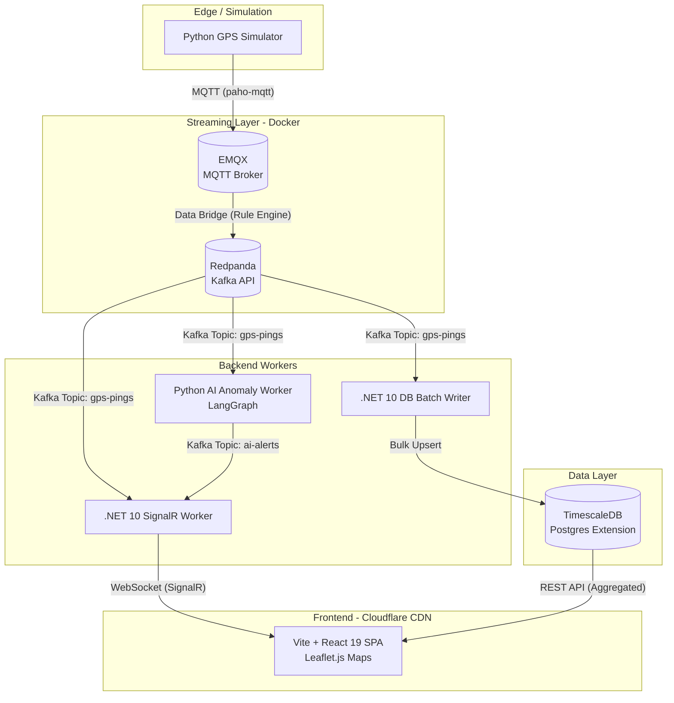

# Architecture
** document: # Architecture.md
## Overview
FleetPulse is a real-time, AI-powered logistics control tower designed to monitor a simulated fleet of delivery motorcycles. It demonstrates a high-throughput, event-driven architecture capable of ingesting high-frequency GPS telemetry, analyzing it for anomalies via LLMs, and visualizing it dynamically on a live map.

This project highlights modern distributed systems concepts: Stream Processing, Micro-batching, Temporal Data Compression, and Decoupled Backend Workers.

## High-Level Architecture
The system follows a strict fan-out pattern. Edge devices (simulated) publish telemetry to a stream broker. Independent backend services consume the stream concurrently based on their domain responsibility. The frontend operates as a pure SPA, receiving real-time pushes via WebSockets.



## Technology Stack & Rationale
| Layer | Technology | Architectural Rationale |
| :--- | :--- | :--- |
| **Telemetry Ingestion** | Python + `paho-mqtt` | MQTT is the industry standard for IoT/edge devices due to minimal bandwidth and battery overhead. |
| **MQTT Broker** | EMQX Broker (Docker) | MQTT broker for IoT that nativily integrates to Kafka-compatible RedPanda. |
| **Message Broker** | Redpanda (Docker) | Native Kafka API compatibility.  |
| **Real-Time Push** | .NET 10 Worker + SignalR | Maintains persistent WebSocket state. SignalR Groups natively handle routing updates to specific fleet managers. |
| **AI / Analytics** | Python + `aiokafka` + LangGraph | Decoupled async worker. Consumes streams without blocking, uses LLMs for contextual anomaly explanations. |
| **Data Storage** | PostgreSQL + TimescaleDB | Relational reliability for transactions, combined with TimescaleDB's `Hypertables` for high-performance time-series compression and `time_bucket()` aggregations. |
| **Frontend** | Vite + React 19 + TS | Pure SPA. Server-Side Rendering (Next.js) is intentionally avoided as real-time data is stale the moment it's rendered. Vite provides superior HMR for map UI tuning. |
| **DB Batch Writer** | .NET DB Batch Writer (background service) | Fast developement with Dapper + inline SQL. Using Npgsql library  |
| **Monitoring & Metrics** | Prometheus | Containerized solutions that doesn't depend on a specifc cloud provider. It provides counter, alert managament and a PromQL query for easy monitoring |
| **Logging collector** | promtail + Grafana loki  | promtail allow us to collect stdout otuputs from docker container. good integration for kubernetes. Loki is a cost effective and easy to operate  |
| **Tracing** | Tempo + otel-collector | otel-collector is a open source vendor-agnostic implementation of OpenTelemetry. Easy to configure and and integrate into python and .net services. Tempo, as part of grafana ecosystem was the default choice since it is open-source easy-to-use and conteinerized solution  |
| **Observability and data visualization platform** | grafana | provides a unified dashboards to connect all the data sources used in the project |
| **Deployment (FE)** | Cloudflare Pages | Static assets served at the edge. Zero cold starts, zero cost, inherently secure. |
| **Deployment (BE)** | Docker Compose (Local) <br> AWS ECS / Azure Container Apps (Prod) | Containerized workloads allow independent scaling of the AI worker vs. the DB writer based on load. |


## Database Access 

```
[ Redpanda Topic: "gps-pings" ]
       │
       ▼
[ .NET DB Batch Writer (Background Service) ]
       │
       ├──> 1. In-Memory Buffer (holds for 5 seconds)
       │
       ├──> 2. Compression Logic (drops stopped-driver duplicates)
       │
       ├──> 3. Bulk INSERT -> TimescaleDB `gps_history` table (Hypertable)
       │
       └──> 4. UPSERT -> TimescaleDB `driver_latest_state` table (500 rows)

[ Redpanda Topic: "alerts" ]
       │
       ▼
[ .NET DB Batch Writer (Background Service) ]
       │
       ├──> 1. INSERT -> Postgresql
       │
       ├──> 2. Hangfire schedule EscalationJob -> Notification
       │
       └──> 3. Hangfire enqueue StandardAlertJob

```


## Local Development Topology
During local development, the entire distributed system is orchestrated via a single docker-compose.yml file, ensuring zero friction for developers cloning the repository.

```
┌──────────────────────────────────────────────────────────┐
│                  Docker Compose Network                  │
│                                                          │
│  ┌──────────────┐  ┌─────────────┐  ┌──────────────────┐ │
│  │  EMQX        │  │ .NET SignalR│  │ Python AI Worker │ │
│  │ (MQTT Broker)│  │   Worker    │  │   (LangGraph)    │ │
│  └──────┬───────┘  └─────┬───────┘  └──────────────────┘ │
│         │               │                                │
│         │ Data Bridge   │                                │
│         ▼               │                                │
│  ┌────────────┐         │                                │
│  │  Redpanda  │<>───────┘                                │
│  │ (Kafka API)│                                          │
│  └──────┬─────┘                                          │
│         │                                                │
│  ┌──────┴─────┐  ┌────────────┐                          │
│  │TimescaleDB │<>│ .NET DB    │                          │
│  │  (Postgres)│  │   Writer   │                          │
│  └────────────┘  └────────────┘                          │
└──────────────────────────────────────────────────────────┘
         ▲                              ▲
         │                              │
    [Python Simulator]            [Vite React SPA]
    (Runs on host)                (Runs on host :5173)
```