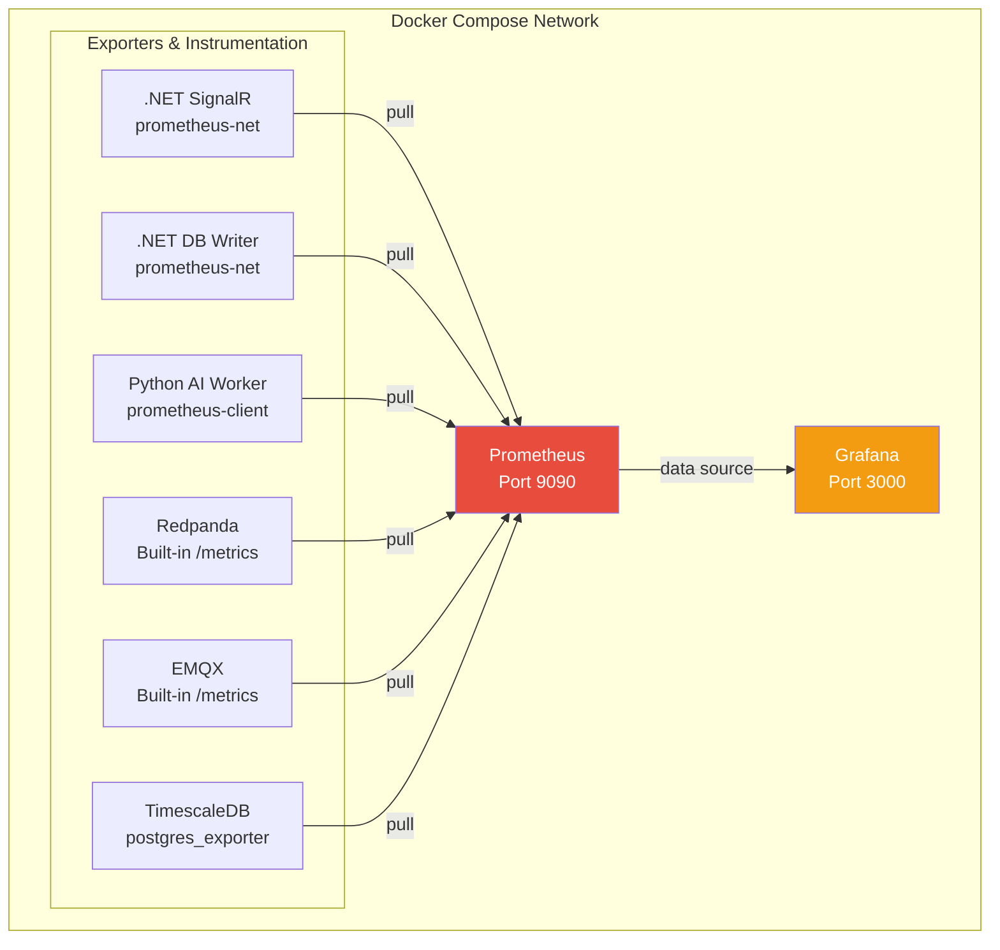

## Prometheus + Grafana Implementation
### Architecture



### Observability Stack

FleetPulse includes a lightweight Prometheus + Grafana observability stack for local development and production pattern demonstration.

### Quick Start

```bash
# Infrastructure is included in docker-compose.yml and docker-compose-obsv
docker compose up -d prometheus grafana postgres-exporter

# Access
# Prometheus: http://localhost:9090
# Grafana:    http://localhost:3000  (admin / fleetpulse)
```

### Prometheus Implementation

FleetPulse includes a Prometheus and Grafana stack for observing the broker, workers, and database components during local development and demo runs. Prometheus collects application and infrastructure metrics from the stream processors, and Grafana is used to visualize dashboards and alerts.

For implementation details, scrape configuration, and example metric definitions, see [README_PROMETHEUS.md](README_PROMETHEUS.md).

#### What Prometheus Monitors

| Service | What is exposed | Default endpoint or path |
| :--- | :--- | :--- |
| Redpanda | Broker and Kafka-style stream metrics | Built-in metrics at `/public_metrics` |
| EMQX | MQTT broker health and message flow metrics | Built-in metrics at `/api/v5/prometheus/stats` |
| TimescaleDB | Database exporter metrics | `postgres-exporter` at `/metrics` |
| SignalR hub | Real-time WebSocket and Kafka consumer metrics | ASP.NET app metrics at `/metrics` |
| DB writer | Batch ingestion and database flush metrics | ASP.NET app metrics at `/metrics` |
| AI worker | AI workflow, alerting, and consumer lag metrics | Python metrics endpoint at `/metrics` |

#### Key Metrics

| Component | Metric | Type | Labels | Meaning |
| :--- | :--- | :--- | :--- | :--- |
| AI worker | fleetpulse_ai_pings_received_total | Counter | none | Total GPS pings received from Kafka. |
| AI worker | fleetpulse_ai_pings_processed_total | Counter | anomaly_detected | Total pings evaluated by the AI worker, split by anomaly outcome. |
| AI worker | fleetpulse_ai_anomaly_detection_seconds | Histogram | anomaly_type | Time spent analyzing a ping for an anomaly. |
| AI worker | fleetpulse_ai_alerts_published_total | Counter | severity | Alerts published by the AI workflow, grouped by severity. |
| AI worker | fleetpulse_ai_kafka_lag_messages | Gauge | none | Estimated consumer lag for the AI worker. |
| DB writer | fleetpulse_dbwriter_gps_pings_received_total | Counter | topic | GPS pings consumed from the stream, grouped by topic. |
| DB writer | fleetpulse_dbwriter_gps_pings_compressed_to_db_total | Counter | none | GPS pings compressed and written to TimescaleDB. |
| DB writer | fleetpulse_dbwriter_db_flush_duration_seconds | Histogram | none | Time spent flushing a batch to the database. |
| SignalR hub | fleetpulse_signalrhub_gps_pings_received_total | Counter | topic | GPS pings consumed by the hub from Kafka. |
| SignalR hub | fleetpulse_signalrhub_alerts_received_total | Counter | topic | Alert messages consumed by the hub from Kafka. |
| SignalR hub | fleetpulse_signalrhub_active_drivers | Gauge | none | Number of unique drivers seen in the last 5 minutes. |
| SignalR hub | fleetpulse_signalrhub_connected_clients | Gauge | none | Current number of connected SignalR clients. |
| SignalR hub | fleetpulse_signalrhub_authentication_errors_total | Counter | none | Authentication failures encountered by the hub. |

#### Alerting Rules

| Alert | Severity | Trigger | What it means |
| :--- | :--- | :--- | :--- |
| HighConsumerLag | warning | Redpanda consumer group lag stays above 1000 for 2 minutes | Kafka consumption is falling behind. |
| NoGpsPingsReceived | critical | GPS ping rate is zero for 2 minutes | The live GPS stream appears to have stopped. |
| HighDbFlushLatency | warning | 99th percentile DB flush time exceeds 0.5 seconds for 5 minutes | Batch writes to TimescaleDB are slowing down. |
| SignalRNoClients | info | No clients are connected for 1 minute | No frontend users are currently viewing the live feed. |

#### Common Endpoints

| Component | Route | Purpose |
| :--- | :--- | :--- |
| Prometheus | `http://localhost:9090` | Query metrics and inspect active targets. |
| Grafana | `http://localhost:3000` | View dashboards and alert status. |

Prometheus is wired through Docker Compose using the observability files under `docker/observability/`. The stack is intended for local visibility, but it also mirrors the shape of a production monitoring setup.


### Log Management: LOKI + PromTail

| Component | Route | Purpose |
| :--- | :--- | :--- |
| promtail  | none | Agent to collect logs from containers |
| Loki  | `http://localhost:3100` | Logs storage and data source for grafana |


```text
┌─────────────────────────────────────────────────────────┐
│                  Docker Compose Network                 │
│                                                         │
│  ┌─────────────┐  ┌─────────────┐  ┌──────────────────┐ │
│  │  EMQX       │  │ .NET SignalR│  │ Python AI Worker │ │
│  │             │  │   Worker    │  │                  │ │
│  └──────┬──────┘  └─────┬───────┘  └────────┬─────────┘ │
│         │               │                   │           │
│         │ stdout        │ stdout            │ stdout    │
│         ▼               ▼                   ▼           │
│  ┌──────────────────────────────────────────────────┐   │
│  │              Promtail (agent)                    │   │
│  │  Discovers containers via Docker socket          │   │
│  └──────────────────────┬───────────────────────────┘   │
│                         │ HTTP push                     │
│                         ▼                                │
│  ┌──────────────────────────────────────────────────┐   │
│  │              Loki (port 3100)                    │   │
│  └──────────────────────┬───────────────────────────┘   │
│                         │ data source                   │
│                         ▼                                │
│                  ┌──────────────┐                       │
│                  │   Grafana    │                       │
│                  │  (existing)  │                       │
│                  └──────────────┘                       │
└─────────────────────────────────────────────────────────┘
```

Log Schema for ai-worker service:
```json
{
  "timestamp": "2026-07-10T12:34:56.789Z",
  "level": "INFO",
  "logger": "fleetpulse_ai.managers.kafka_consumer",
  "service": "db-writer",
  "version": "1.0.0",
  "message": "Flushed batch to TimescaleDB",
  "driver_id": "DRV-042", 
  "duration_ms": 38,
  "other_properties": "add other properties here as needed"
}
```

* Python logging library: structlog

* .Net logging library: Serilog, Serilog.Sinks.Console
 

### Tracing + OpenTelemetry

```text
┌───────────────────────────────────────────────────────────────┐
│                  Docker Compose Network                       │
│                                                               │
│  Simulator  SignalRHub  DbWriter  AiWorker  (React SPA)       │
│      │          │          │         │           │            │
│      └──────────┴──────────┴─────────┴───────────┘            │
│                         │ OTLP/gRPC (4317) or HTTP (4318)     │
│                         ▼                                     │
│              ┌──────────────────────┐                         │
│              │  OTel Collector      │  ← tail sampling,       │
│              │  (port 4317/4318)    │    batching, retries    │
│              └─────┬──────────┬─────┘                         │
│                    │          │                               │
│          OTLP      │          │  Loki exporter (trace_id)     │
│                    ▼          ▼                               │
│              ┌─────────┐  ┌─────────┐                         │
│              │ Tempo   │  │  Loki   │  (already running)      │
│              │  :3200  │  │  :3100  │                         │
│              └────┬────┘  └────┬────┘                         │
│                   │           │                               │
│                   └─────┬─────┘                               │
│                         ▼                                     │
│                   ┌───────────┐                               │
│                   │  Grafana  │  (already running)            │
│                   │  :3000    │                               │
│                   └───────────┘                               │
└───────────────────────────────────────────────────────────────┘
```

* Tracing Headers
 1. Simulator sets traceparent and tracestate headers in MQTT user properties.
 2. EMQX maps user properties into kafka_ext_header_value values.
 3. AI Worker sets traceparent and tracestate into Kafka headers for generated alerts.
 4. .NET services recover traceparent / tracestate from Kafka headers and linka new Activity to the upstream trace.
 
 
#### .NET context propagation
Both .NET services use the W3C TraceContextPropagator (default in .NET 8+) toextract an ActivityContext from Kafka headers, then start a Consumer spanparented to it. This is what keeps the trace continuous across the Python → Kafka→ .NET boundary.

Packages (added to both FleetPulse.SignalRHub and FleetPulse.DbWriter):

OpenTelemetry
OpenTelemetry.Extensions.Hosting
OpenTelemetry.Exporter.OpenTelemetryProtocol
OpenTelemetry.Instrumentation.AspNetCore
OpenTelemetry.Instrumentation.Http
Npgsql.OpenTelemetry (DbWriter only — instruments the bulk UPSERTs)
Registration (Program.cs):

builder.Services.AddOpenTelemetry()    .ConfigureResource(r => r.AddService("FleetPulse.SignalRHub", "1.0.0"))    .WithTracing(tp => tp        .AddSource("FleetPulse.SignalRHub.GpsPingConsumer")        .AddAspNetCoreInstrumentation()        .AddHttpClientInstrumentation()        .AddOtlpExporter(o => o.Endpoint = new Uri("http://otel-collector:4317")));
Header extraction (Confluent.Kafka Headers):

```csharp
private static readonly TextMapPropagator Propagator = new TraceContextPropagator();

private static ActivityContext Extract(Headers? headers)
{
    if (headers is null) return default;
    return Propagator.Extract(default, headers, (h, name) =>
        h.TryGetLastBytes(name, out var b)
            ? new[] { Encoding.UTF8.GetString(b) }
            : Array.Empty<string>()).ActivityContext;
}
```
Consumer span (linked to the upstream Python trace):

```csharp
var parentCtx = Extract(consumeResult.Message.Headers);

using var activity = ActivitySource.StartActivity(
    "kafka.consume", ActivityKind.Consumer, parentCtx.ActivityContext);

activity?.SetTag("messaging.system",         "kafka");
activity?.SetTag("messaging.destination",    "gps-pings");
activity?.SetTag("messaging.kafka.partition", consumeResult.Partition.Value);
activity?.SetTag("messaging.kafka.offset",   consumeResult.Offset.Value);
activity?.SetTag("messaging.operation",       "process");
activity?.SetTag("fleetpulse.driver_id",      ping.DriverId);
```

Result in Tempo/Grafana: the trace starts in the Python simulator, hops through
EMQX → Redpanda, and continues inside the .NET SignalRHub and DbWriter spans,
sharing the same trace-id.
