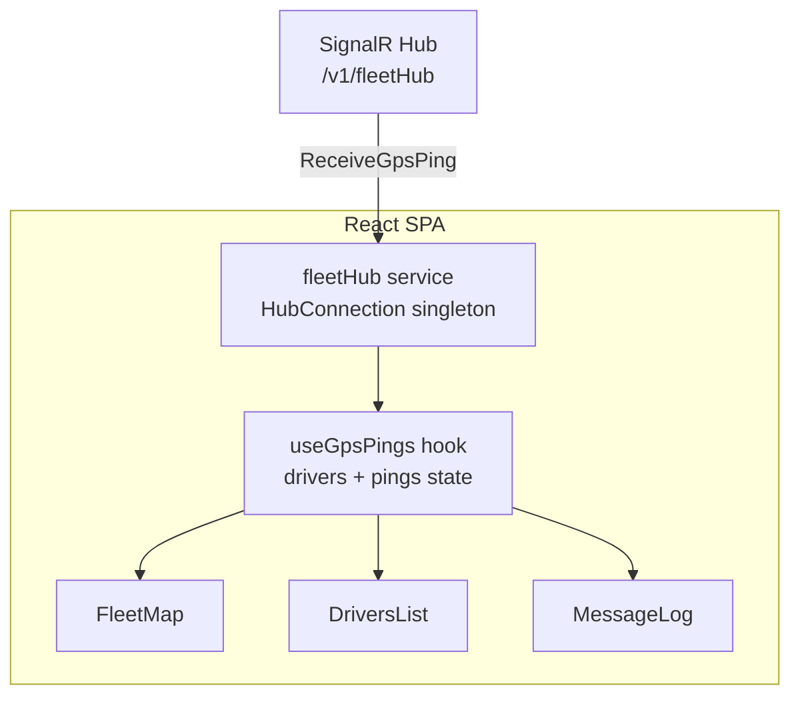

## Fleet.Pulse.Frontend

The `FleetPulse.Frontend` is a React 19 + TypeScript Single-Page Application built with Vite. Its primary purpose is to visualize real-time driver telemetry pushed by the SignalR hub and present it in three synchronized views:

1. **Map view** (live geospatial position)
2. **Driver roster** (operational status by driver)
3. **Raw event log** (recent ping stream for observability/debugging)

### Frontend Runtime Architecture



### Functional Responsibilities

| Area | Implementation | Responsibility |
| :--- | :--- | :--- |
| **Transport** | `@microsoft/signalr` | Maintains a persistent WebSocket connection to the backend hub (`/v1/fleetHub`). |
| **Connection Lifecycle** | `fleetHub` service | Handles connect/start, automatic reconnect backoff, receive callback registration (`ReceiveGpsPing`), and optional group subscription (`SubscribeFleet`). |
| **State Aggregation** | `useGpsPings` hook | Builds in-memory state from stream events: latest ping per driver (`drivers`) and rolling event history (`pings`, capped to 200). |
| **Geospatial Visualization** | `react-leaflet` + OpenStreetMap | Renders one marker per active driver with popup metadata (driver, speed, status). |
| **Operational UI** | `DriversList`, `MessageLog` | Exposes status and traceability views for operators during simulation. |

### Data Contracts Used by the SPA

The frontend consumes `GpsPing` payloads pushed by SignalR:

```json
{
  "driver_id": "string",
  "latitude": 0.0,
  "longitude": 0.0,
  "speed_kmh": 0.0,
  "heading_degrees": 0.0,
  "accuracy_meters": 0.0,
  "status": "moving|stopped|...",
  "vehicle_type": "string|null",
  "timestamp": "ISO-8601"
}
```

### UI Composition

The current layout is a 3-panel operational console:

- Left panel: driver list + status badges
- Center panel: live map viewport (`~60vh`) with markers
- Right panel: scrolling raw ping log (textarea, monospace)

This layout is optimized for rapid local debugging of stream quality and real-time behavior rather than for polished dashboard aesthetics.

### Connection and Resilience Strategy

- Automatic reconnect strategy: `[0, 2000, 5000, 10000, 30000]` ms retry delays
- Credentials enabled in WebSocket handshake (`withCredentials: true`) to align with backend CORS policy
- Event fan-out pattern on client: one SignalR callback dispatches to local subscribers
- Rolling memory cap (`MAX_PINGS = 200`) prevents unbounded growth in browser memory

### Configuration

The hub URL is environment-driven via Vite:

```env
VITE_FLEET_HUB_URL=http://localhost:xxxx/v1/fleetHub
```

This keeps frontend deployment flexible across local Docker, staging, and production endpoints without code changes.

### Design Decisions

| Decision | Rationale |
| :--- | :--- |
| Pure SPA (no SSR) | Telemetry is high-frequency and quickly stale; client-side rendering is the correct tradeoff for live coordinates. |
| SignalR for push channel | Simplifies browser real-time networking and reconnect behavior over raw WebSocket management. |
| Hook-based state (`useGpsPings`) | Keeps stream processing logic isolated from rendering components. |
| Leaflet + OSM tiles | Lightweight open mapping stack, easy to run locally without vendor lock-in. |
| Dedicated map/list/log views | Supports both operations visibility and low-level debugging during simulator bursts. |

### Frontend Dependencies (Current)

Core runtime libraries:

- `react`, `react-dom`
- `@microsoft/signalr`
- `leaflet`, `react-leaflet`
- `recharts` (available for analytics widgets)

Build and styling toolchain:

- `vite`, `typescript`
- `tailwindcss`, `@tailwindcss/vite`, `postcss`, `autoprefixer`

